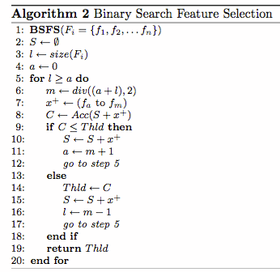

<h2>The breif description of model is listed below:</h2>
<ul>
<li>Generate word-based features by analyzing frequently appearing words of email’s subjects and contents.</li>
<li>Generate link-based features by examining the URL links embedded in an email.</li>
<li>Generate the readability-based features using eight well-known readability algorithms and applying them to discriminate the text contents of phishing emails and legitimate emails.</li>
<li>Verify the best features set by comparing with other feature selection algorithms on the basis of time, accu- racy and number of features.</li>
<li>Justify the method by comparing the results with the existing approaches.</li>
  </ul>
  
  
<h2>Features from Hyperlinks</h2>
  
<ul>
  <li>has http</li>
  <li>has hypen</li>
  <li>num of subdomins</li>
  <li>has ipaddress</li>
  </ul>

<h2>Features from Readability Algorithms</h2>
<ul>
  <li>Automated Readability Index</li>
  <li>Coleman Liau Index</li>
  <li>Flesch–Kincaid Readability Test</li>
  <li>Gunning Fog Index</li>
  <li>SMOG Index</li>
  <li>LIX Readability Score</li>
  </ul>
  
    

  
